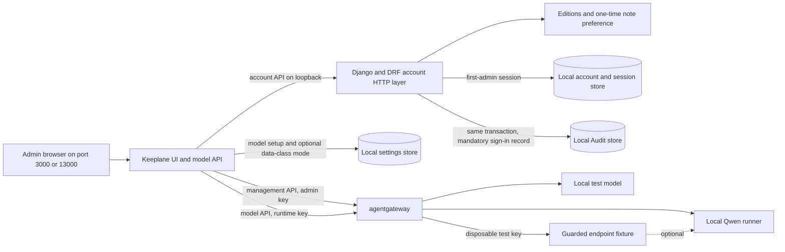

# Local model preview architecture

This is the first running Open Source slice. Keeplane owns the screen and the
small registration/call API; agentgateway owns model transport and its model
registry. The test fixture is replaceable with a local Qwen runner.

Only Keeplane is published on loopback. The gateway management API and model
endpoints stay on the private Compose network and require separate keys. The
gateway stores registrations in a Docker volume so a restart does not erase
them. Docker runs one gateway replica and kind runs two. Project-bound and
final-destination policy enforcement need later work.
The guarded endpoint accepts only its fixed test key and forwards chat requests
to Qwen. Keeplane registers that key through the gateway management API, and
its model-list API omits the key. The fixture runs on Docker's private network
and does not represent production secret storage or external-provider TLS.

## Protected Open Source Docker trial

The single app on port 3000 has a local SQLite account store. It checks a
revocable session cookie before serving the admin UI and APIs. The
account store owns the first admin, users, roles and Editions note preferences; model
approvals and audit records stay in their separate local tables. A first-admin
session and its mandatory Audit record commit together; an Audit write failure
refuses the sign-in. The app
uses the gateway through the internal Docker network. Existing gateway and
account volumes are reused when the stack starts again. A fresh account store
has no Team tables or Team API.
Data classes start off in a fresh settings store. The React Data Classes page
turns them on, creating starter definitions once. Turning them off leaves
definitions and approvals stored but removes class controls from the admin UI.
Model setup remains a separate record, including when a model has no class
approval. This trial has no project-class enforcement yet.
React's account requests now pass through an internal Django and DRF HTTP
layer. The existing local account use cases still own the SQLite trial store,
and the model, Data Classes and Audit HTTP routes remain in the earlier Python
server. The internal Django listener binds to container loopback; only Keeplane
port 3000 (Docker) or 13000 (kind) is published. If the account listener fails,
the public account route returns 503 rather than falling back to the old route.
This is an account API cutover, not the completed Django ORM and PostgreSQL
release persistence cutover.
The Docker and managed kind trials use the same local account API and React
screens. They have separate account, audit and approval stores; a change in one
preview does not appear in the other. The kind trial stores its SQLite files
and provider-key files in local PersistentVolumeClaims and mounts the gateway's
file-owned fixture configuration for approval verification. Both trials read
the same first-admin password file on the developer machine. Neither trial
installs Keycloak or an SSO proxy. The kind trial storage and password Secret
are local integration fixtures, not the approved PostgreSQL release identity
design. Optional OpenID Connect sign-in remains later Open Source work behind
the Keeplane account contract.
